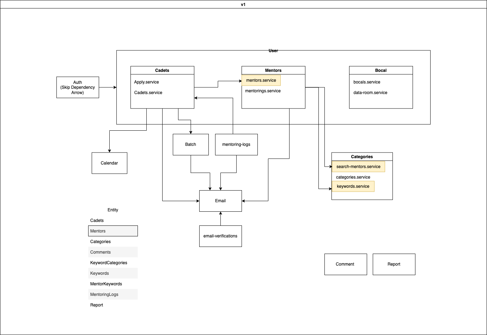

# 📝 TODO

## 검색

- [x] 이름순 정렬 기능 추가

- [ ] 1달 기준 멘토링 많이 한 순서로 정렬 기능 추가

- [ ] 가장 최근 멘토링을 진행한 순으로 정렬 기능 추가

- [ ] 당일 가능시간이 가장 많은 순으로 정렬 기능 추가

- [ ] 댓글 많은 순으로 정렬 기능 추가

- [x] 랜덤 기능 추가

- [ ] 멘토 전체 검색 기능 추가

- [ ] 멘토 검색 컨트롤러 재설계

- [ ] 멘토 검색 컨트롤러 구현

## 멘토링

**멘토링 가능한 시간 관련 리팩토링**

> 어떻게?, 물어보기

**다수 멘토링 기능**

- [ ] 다수 멘토링 기능 추가

  - [ ] MentoringLogs Entity 카뎃 관계 다대일 변경

  - [ ] MentoringLogs ERD 수정

  - [ ] 멘토링 Apply 컨트롤러 및 함수 수정

- [ ] 카뎃 이름 검색 컨트롤러 구현

- [ ] 카뎃 이름 검색 함수 구현

> 멘토링을 받는 카뎃은 모두 42polar에 가입 되어 있어야 함

## 보고서

- [x] updateAt 추가

> 이미 있었음

- [ ] 보고서 히스토리 기능

  - [x] Reports Entity `history` 스트링 배열 컬럼 추가

  - [ ] Reports ERD 수정

  - [ ] 레포트 수정 시, 레포트 객체 직렬화 후 `record` 컬럼에 추가

  - [ ] 레포트 기록 보는 컨트롤러 구현 (보컬만 확인 가능)

- [ ] 보고서 카뎃 추가 기능

- [ ] 보고서 카뎃 제거 기능

## 카뎃

- [ ] 나의 멘토링 페이지네이션 기능 추가

> 기존 전체 가져오는 기능은 유지

## 보컬

- [ ] 보컬은 모든 레포트를 수정할 수 있게 권한 추가

> 현재 보고서를 `작성중`, `작성 완료`로만 구분하여 데이터 룸에 표시하기 때문에,
>
> 임의로 수정 권한을 줬을 때 `작성중`으로 바뀌어
>
> 보컬이 데이터룸에서 확인할 수 없음

- [ ] 보컬이 완료된 레포트의 상태를 변경할 수 있는 기능 추가

  - [ ] Reports Entity 임시 수정 권한을 나타내는 boolean 컬럼 추가

  - [ ] Reports ERD 수정

- [ ] 보컬이 일괄적으로 모든 레포트의 상태를 변경할 수 있는 기능 추가

> 9월, 10월 등 달 별로 적용?

- [ ] 보컬이 멘토의 활성화/비활성화 상태를 변경할 수 있는 기능 추가
